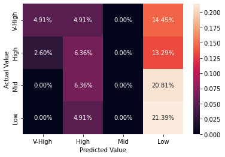
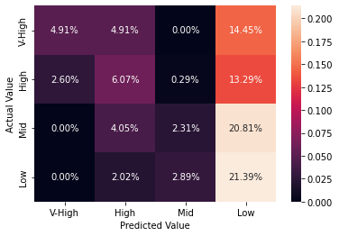
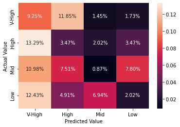
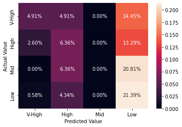

```python
#Import libraries
import os
import pandas as pd
import numpy as np
import matplotlib.pyplot as plt
from matplotlib import style
import seaborn as sns
from sklearn.model_selection import train_test_split
from sklearn.metrics import confusion_matrix
import warnings
warnings.simplefilter(action="ignore", category=FutureWarning)
```


```python
#Set global variables
fpath = "/Users/chuying/Documents/senior-de-assessment/q5/data/"
```


```python
#Change the current working directory
os.chdir(fpath)
print("Current working dir: ", os.getcwd())
```

    Current working dir:  /Users/chuying/Documents/senior-de-assessment/q5/data


## Step 1: Data Wrangling


```python
#Read data files and add column header
df = pd.read_csv('car.data', sep=",", header = None)
df.columns = ["buying", "maint", "doors", "persons", "lug_boot", "safety", "class"]
df
```


<div>
<style scoped>
    .dataframe tbody tr th:only-of-type {
        vertical-align: middle;
    }

    .dataframe tbody tr th {
        vertical-align: top;
    }

    .dataframe thead th {
        text-align: right;
    }
</style>
<table border="1" class="dataframe">
  <thead>
    <tr style="text-align: right;">
      <th></th>
      <th>buying</th>
      <th>maint</th>
      <th>doors</th>
      <th>persons</th>
      <th>lug_boot</th>
      <th>safety</th>
      <th>class</th>
    </tr>
  </thead>
  <tbody>
    <tr>
      <th>0</th>
      <td>vhigh</td>
      <td>vhigh</td>
      <td>2</td>
      <td>2</td>
      <td>small</td>
      <td>low</td>
      <td>unacc</td>
    </tr>
    <tr>
      <th>1</th>
      <td>vhigh</td>
      <td>vhigh</td>
      <td>2</td>
      <td>2</td>
      <td>small</td>
      <td>med</td>
      <td>unacc</td>
    </tr>
    <tr>
      <th>2</th>
      <td>vhigh</td>
      <td>vhigh</td>
      <td>2</td>
      <td>2</td>
      <td>small</td>
      <td>high</td>
      <td>unacc</td>
    </tr>
    <tr>
      <th>3</th>
      <td>vhigh</td>
      <td>vhigh</td>
      <td>2</td>
      <td>2</td>
      <td>med</td>
      <td>low</td>
      <td>unacc</td>
    </tr>
    <tr>
      <th>4</th>
      <td>vhigh</td>
      <td>vhigh</td>
      <td>2</td>
      <td>2</td>
      <td>med</td>
      <td>med</td>
      <td>unacc</td>
    </tr>
    <tr>
      <th>...</th>
      <td>...</td>
      <td>...</td>
      <td>...</td>
      <td>...</td>
      <td>...</td>
      <td>...</td>
      <td>...</td>
    </tr>
    <tr>
      <th>1723</th>
      <td>low</td>
      <td>low</td>
      <td>5more</td>
      <td>more</td>
      <td>med</td>
      <td>med</td>
      <td>good</td>
    </tr>
    <tr>
      <th>1724</th>
      <td>low</td>
      <td>low</td>
      <td>5more</td>
      <td>more</td>
      <td>med</td>
      <td>high</td>
      <td>vgood</td>
    </tr>
    <tr>
      <th>1725</th>
      <td>low</td>
      <td>low</td>
      <td>5more</td>
      <td>more</td>
      <td>big</td>
      <td>low</td>
      <td>unacc</td>
    </tr>
    <tr>
      <th>1726</th>
      <td>low</td>
      <td>low</td>
      <td>5more</td>
      <td>more</td>
      <td>big</td>
      <td>med</td>
      <td>good</td>
    </tr>
    <tr>
      <th>1727</th>
      <td>low</td>
      <td>low</td>
      <td>5more</td>
      <td>more</td>
      <td>big</td>
      <td>high</td>
      <td>vgood</td>
    </tr>
  </tbody>
</table>
<p>1728 rows × 7 columns</p>
</div>


```python
#df['persons'].unique()
#df['doors'].unique()
```


```python
#convert numerical columns
df['doors'].replace(to_replace=['5more'], value=[5], inplace=True)
df['persons'].replace(to_replace=['more'], value=[6], inplace=True)
```


```python
#convert categorical value to numerical value representation
df['buying'].replace(to_replace=['vhigh', 'high', 'med','low'], value=[4, 3, 2, 1], inplace=True)
df['maint'].replace(to_replace=['vhigh', 'high', 'med','low'], value=[4, 3, 2, 1], inplace=True)
df['lug_boot'].replace(to_replace=['big', 'med', 'small'], value=[3, 2, 1], inplace=True)
df['safety'].replace(to_replace=['high', 'med', 'low'], value=[3, 2, 1], inplace=True)
df['class'].replace(to_replace=['vgood', 'good', 'acc', 'unacc'], value=[4, 3, 2, 1], inplace=True)
```


```python
df.head()
```


<div>
<style scoped>
    .dataframe tbody tr th:only-of-type {
        vertical-align: middle;
    }

    .dataframe tbody tr th {
        vertical-align: top;
    }

    .dataframe thead th {
        text-align: right;
    }
</style>
<table border="1" class="dataframe">
  <thead>
    <tr style="text-align: right;">
      <th></th>
      <th>buying</th>
      <th>maint</th>
      <th>doors</th>
      <th>persons</th>
      <th>lug_boot</th>
      <th>safety</th>
      <th>class</th>
    </tr>
  </thead>
  <tbody>
    <tr>
      <th>0</th>
      <td>4</td>
      <td>4</td>
      <td>2</td>
      <td>2</td>
      <td>1</td>
      <td>1</td>
      <td>1</td>
    </tr>
    <tr>
      <th>1</th>
      <td>4</td>
      <td>4</td>
      <td>2</td>
      <td>2</td>
      <td>1</td>
      <td>2</td>
      <td>1</td>
    </tr>
    <tr>
      <th>2</th>
      <td>4</td>
      <td>4</td>
      <td>2</td>
      <td>2</td>
      <td>1</td>
      <td>3</td>
      <td>1</td>
    </tr>
    <tr>
      <th>3</th>
      <td>4</td>
      <td>4</td>
      <td>2</td>
      <td>2</td>
      <td>2</td>
      <td>1</td>
      <td>1</td>
    </tr>
    <tr>
      <th>4</th>
      <td>4</td>
      <td>4</td>
      <td>2</td>
      <td>2</td>
      <td>2</td>
      <td>2</td>
      <td>1</td>
    </tr>
  </tbody>
</table>
</div>


## Step 2: Exploratory Data Analysis


```python
#2.1 Data is structured
#2.2 Entity of interest - Buying Price
#2.3 1 row  = 1 record
#2.4 1 column = 1 field
#2.5 Yes, there is a data column to identify my event
#2.6 Categorise my variables - both numerical and categorical
#Training model: Classification (Goal: Predict a category)
df.info()
df.describe()
```

    <class 'pandas.core.frame.DataFrame'>
    RangeIndex: 1728 entries, 0 to 1727
    Data columns (total 7 columns):
     #   Column    Non-Null Count  Dtype 
    ---  ------    --------------  ----- 
     0   buying    1728 non-null   int64 
     1   maint     1728 non-null   int64 
     2   doors     1728 non-null   object
     3   persons   1728 non-null   object
     4   lug_boot  1728 non-null   int64 
     5   safety    1728 non-null   int64 
     6   class     1728 non-null   int64 
    dtypes: int64(5), object(2)
    memory usage: 94.6+ KB


<div>
<style scoped>
    .dataframe tbody tr th:only-of-type {
        vertical-align: middle;
    }

    .dataframe tbody tr th {
        vertical-align: top;
    }

    .dataframe thead th {
        text-align: right;
    }
</style>
<table border="1" class="dataframe">
  <thead>
    <tr style="text-align: right;">
      <th></th>
      <th>buying</th>
      <th>maint</th>
      <th>lug_boot</th>
      <th>safety</th>
      <th>class</th>
    </tr>
  </thead>
  <tbody>
    <tr>
      <th>count</th>
      <td>1728.000000</td>
      <td>1728.000000</td>
      <td>1728.000000</td>
      <td>1728.000000</td>
      <td>1728.000000</td>
    </tr>
    <tr>
      <th>mean</th>
      <td>2.500000</td>
      <td>2.500000</td>
      <td>2.000000</td>
      <td>2.000000</td>
      <td>1.414931</td>
    </tr>
    <tr>
      <th>std</th>
      <td>1.118358</td>
      <td>1.118358</td>
      <td>0.816733</td>
      <td>0.816733</td>
      <td>0.740700</td>
    </tr>
    <tr>
      <th>min</th>
      <td>1.000000</td>
      <td>1.000000</td>
      <td>1.000000</td>
      <td>1.000000</td>
      <td>1.000000</td>
    </tr>
    <tr>
      <th>25%</th>
      <td>1.750000</td>
      <td>1.750000</td>
      <td>1.000000</td>
      <td>1.000000</td>
      <td>1.000000</td>
    </tr>
    <tr>
      <th>50%</th>
      <td>2.500000</td>
      <td>2.500000</td>
      <td>2.000000</td>
      <td>2.000000</td>
      <td>1.000000</td>
    </tr>
    <tr>
      <th>75%</th>
      <td>3.250000</td>
      <td>3.250000</td>
      <td>3.000000</td>
      <td>3.000000</td>
      <td>2.000000</td>
    </tr>
    <tr>
      <th>max</th>
      <td>4.000000</td>
      <td>4.000000</td>
      <td>3.000000</td>
      <td>3.000000</td>
      <td>4.000000</td>
    </tr>
  </tbody>
</table>
</div>


```python
#Check for missing data in any of the columns
check_null = df.isnull().sum()
print(check_null)
```

    buying      0
    maint       0
    doors       0
    persons     0
    lug_boot    0
    safety      0
    class       0
    dtype: int64


## Step 3: Model Training and Testing
### Specifying the Features and Splitting Training Data


```python
from sklearn import model_selection
from sklearn import metrics
```


```python
#Features selection, omitted "persons" as it is not part of our predictors
features = [
    'maint',
    'doors',
    'lug_boot',
    'safety',
    'class'
]
```


```python
target = 'buying'
```


```python
# Splitting the data for training and testing
# Keep 20% of the data for testing
# Set random_state=1999
X_train, X_test, y_train, y_test = model_selection.train_test_split(df[features], df[target], test_size=.20, random_state=1999)
```

### Model A: Decision tree classifier 


```python
from sklearn.tree import DecisionTreeClassifier
```


```python
dtree_model = DecisionTreeClassifier(max_depth = 2).fit(X_train, y_train)
dtree_predictions = dtree_model.predict(X_test)
 
# model accuracy for X_test  
accuracy = dtree_model.score(X_test, y_test)
print(accuracy)

# creating a confusion matrix
cm = confusion_matrix(y_test, dtree_predictions)
print(cm)
```

    0.3265895953757225
    [[17 17  0 50]
     [ 9 22  0 46]
     [ 0 22  0 72]
     [ 0 17  0 74]]


```python
# Visualization the Confusion Matrix
sns.heatmap(metrics.confusion_matrix(y_test, dtree_predictions)/ len(y_test),
            annot=True, fmt='.2%', 
            xticklabels=['V-High', 'High', 'Mid', 'Low'], 
            yticklabels=['V-High', 'High', 'Mid', 'Low'])

plt.xlabel('Predicted Value')
plt.ylabel('Actual Value')
```


    Text(33.0, 0.5, 'Actual Value')


    

    


### Model B: SVM (Support vector machine) classifier


```python
from sklearn.svm import SVC
```


```python
# training a linear SVM classifier
svm_model_linear = SVC(kernel = 'linear', C = 1).fit(X_train, y_train)
svm_predictions = svm_model_linear.predict(X_test)
  
# model accuracy for X_test  
accuracy = svm_model_linear.score(X_test, y_test)
print(accuracy)

# creating a confusion matrix
cm = confusion_matrix(y_test, svm_predictions)
print(cm)
```

    0.3468208092485549
    [[17 17  0 50]
     [ 9 21  1 46]
     [ 0 14  8 72]
     [ 0  7 10 74]]


```python
# Visualization the Confusion Matrix
sns.heatmap(metrics.confusion_matrix(y_test, svm_predictions)/ len(y_test),
            annot=True, fmt='.2%', 
            xticklabels=['V-High', 'High', 'Mid', 'Low'], 
            yticklabels=['V-High', 'High', 'Mid', 'Low'])

plt.xlabel('Predicted Value')
plt.ylabel('Actual Value')
```


    Text(33.0, 0.5, 'Actual Value')


    

    


### Model C: KNN (k-nearest neighbors) classifier


```python
from sklearn.neighbors import KNeighborsClassifier
```


```python
# training a KNN classifier
knn = KNeighborsClassifier(n_neighbors = 3).fit(X_train, y_train)
  
# accuracy on X_test
accuracy = knn.score(X_test, y_test)
print(accuracy)
  
# creating a confusion matrix
knn_predictions = knn.predict(X_test) 
cm = confusion_matrix(y_test, knn_predictions)
print(cm)
```

    0.15606936416184972
    [[32 41  5  6]
     [46 12  7 12]
     [38 26  3 27]
     [43 17 24  7]]


```python
# Visualization the Confusion Matrix
sns.heatmap(metrics.confusion_matrix(y_test, knn_predictions)/ len(y_test),
            annot=True, fmt='.2%', 
            xticklabels=['V-High', 'High', 'Mid', 'Low'], 
            yticklabels=['V-High', 'High', 'Mid', 'Low'])

plt.xlabel('Predicted Value')
plt.ylabel('Actual Value')
```


    Text(33.0, 0.5, 'Actual Value')


    

    


### Model D: Naive Bayes classifier


```python
from sklearn.naive_bayes import GaussianNB
```


```python
# training a Naive Bayes classifier
gnb = GaussianNB().fit(X_train, y_train)
gnb_predictions = gnb.predict(X_test)
  
# accuracy on X_test
accuracy = gnb.score(X_test, y_test)
print(accuracy)
  
# creating a confusion matrix
cm = confusion_matrix(y_test, gnb_predictions)
print(cm)
```

    0.3265895953757225
    [[17 17  0 50]
     [ 9 22  0 46]
     [ 0 22  0 72]
     [ 2 15  0 74]]


```python
# Visualization the Confusion Matrix
sns.heatmap(metrics.confusion_matrix(y_test, gnb_predictions)/ len(y_test),
            annot=True, fmt='.2%', 
            xticklabels=['V-High', 'High', 'Mid', 'Low'], 
            yticklabels=['V-High', 'High', 'Mid', 'Low'])

plt.xlabel('Predicted Value')
plt.ylabel('Actual Value')
```


    Text(33.0, 0.5, 'Actual Value')


    

    


```python
#Input test cases into model selected (SVM) due to highest accuracy score
#Maintenance = High ; Number of doors = 4 ; Lug Boot Size = Big ; Safety = High ; Class Value = Good
svm_model_linear.predict([[3, 4, 3, 3, 3]]) #1 means that the buying price is low 
```

    /usr/local/lib/python3.9/site-packages/sklearn/base.py:445: UserWarning: X does not have valid feature names, but SVC was fitted with feature names
      warnings.warn(


    array([1])


```python
#Refereces: 
#[1] https://www.geeksforgeeks.org/multiclass-classification-using-scikit-learn/
#[2] https://scikit-learn.org/stable/modules/generated/sklearn.metrics.precision_score.html
```
